# Звіт про тестування BrainRush API

**Проект:** BrainRush  
**Версія API:** 1.0.0  
**Дата тестування:** [Вставте дату]  
**Автор:** [Ваше ім'я]

---

## Зміст

1. [Огляд API](#огляд-api)
2. [Endpoints API](#endpoints-api)
3. [Результати тестування](#результати-тестування)
4. [Обробка помилок](#обробка-помилок)
5. [Висновки](#висновки)

---

## Огляд API

BrainRush API надає RESTful інтерфейс для взаємодії з платформою когнітивних тренувань. API підтримує операції з користувачами, магазином, відгуками та статистикою ігор.

**Base URL:** `http://localhost:5000/api/v1`

**Документація:** `http://localhost:5000/api/docs` (Swagger UI)

**Автентифікація:** Cookie-based authentication (Flask session)

---

## Endpoints API

### 1. Отримати профіль користувача

- **URL:** `/api/v1/user/profile`
- **Метод:** `GET`
- **Опис:** Повертає повну інформацію про профіль авторизованого користувача
- **Автентифікація:** Обов'язкова

**Приклад запиту:**
```http
GET /api/v1/user/profile HTTP/1.1
Host: localhost:5000
Cookie: session=...
```

**Приклад відповіді:**
```json
{
  "id": 1,
  "username": "testuser",
  "role": "user",
  "coins": 450,
  "theme": "dark",
  "total_games": 15,
  "total_points": 2340,
  "total_coins_earned": 234,
  "created_at": "2025-12-01T10:30:00"
}
```

**Скріншот з Postman:**  
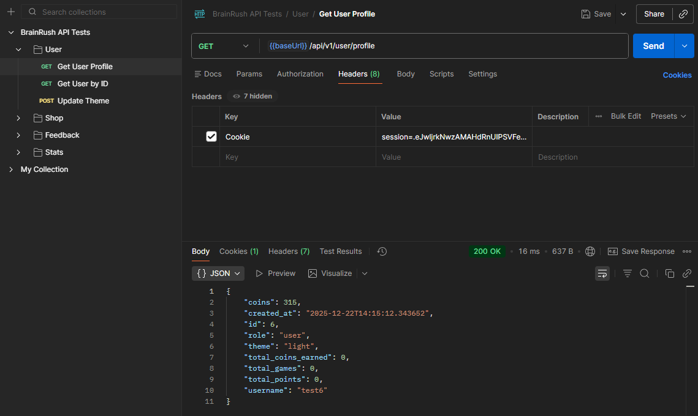

---

### 2. Отримати користувача за ID

- **URL:** `/api/v1/user/{user_id}`
- **Метод:** `GET`
- **Опис:** Повертає публічну інформацію про користувача за його ID
- **Автентифікація:** Обов'язкова

**Параметри:**
- `user_id` (path) - ID користувача (integer)

**Приклад запиту:**
```http
GET /api/v1/user/5 HTTP/1.1
Host: localhost:5000
Cookie: session=...
```

**Приклад відповіді:**
```json
{
  "id": 5,
  "username": "player123",
  "total_games": 25,
  "total_points": 4500,
  "created_at": "2025-11-15T14:20:00"
}
```

**Скріншот з Postman:**  
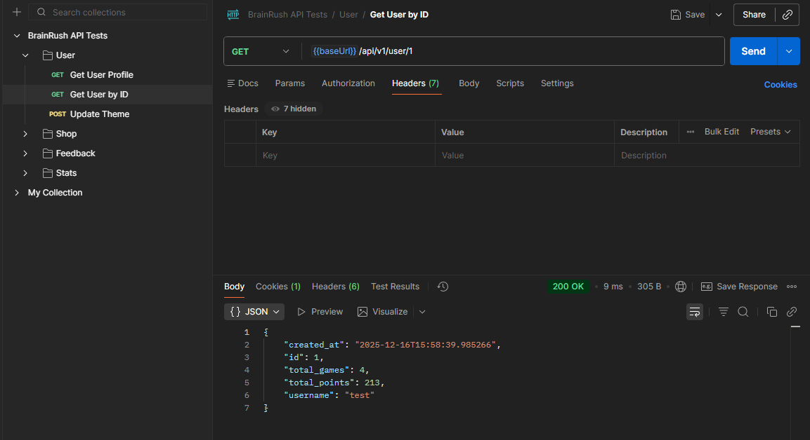

---

### 3. Змінити тему користувача

- **URL:** `/api/v1/user/theme`
- **Метод:** `POST`
- **Опис:** Змінює тему інтерфейсу користувача (світла/темна)
- **Автентифікація:** Обов'язкова

**Приклад запиту:**
```json
{
  "theme": "dark"
}
```

**Приклад відповіді:**
```json
{
  "success": true,
  "theme": "dark"
}
```

**Скріншот з Postman:**  
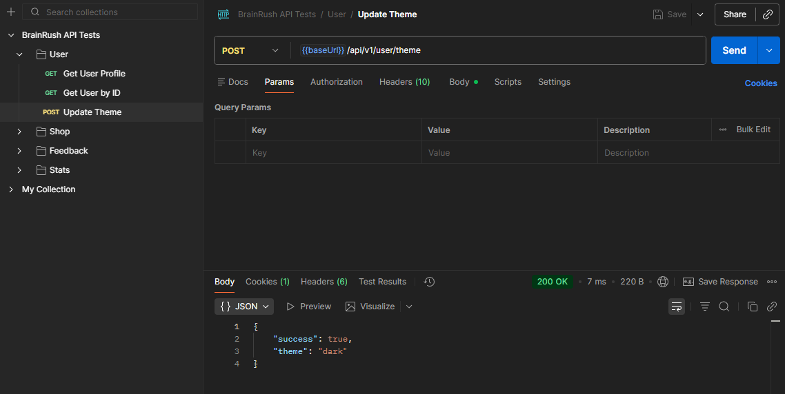

---

### 4. Отримати всі товари магазину

- **URL:** `/api/v1/shop/items`
- **Метод:** `GET`
- **Опис:** Повертає список всіх активних товарів у магазині з інформацією про покупки користувача
- **Автентифікація:** Обов'язкова

**Приклад відповіді:**
```json
{
  "items": [
    {
      "id": 1,
      "item_type": "game",
      "name": "Color Rush",
      "description": "Test your color recognition speed",
      "price": 50,
      "is_purchased": false,
      "created_at": "2025-12-01T10:00:00"
    },
    {
      "id": 2,
      "item_type": "theme",
      "name": "Dark Theme Pro",
      "description": "Premium dark theme",
      "price": 100,
      "is_purchased": true,
      "created_at": "2025-12-01T10:00:00"
    }
  ],
  "user_coins": 450
}
```

**Скріншот з Postman:**  


---

### 5. Купити товар

- **URL:** `/api/v1/shop/purchase/{item_id}`
- **Метод:** `POST`
- **Опис:** Здійснює покупку товару з магазину
- **Автентифікація:** Обов'язкова

**Параметри:**
- `item_id` (path) - ID товару (integer)

**Приклад успішної відповіді:**
```json
{
  "success": true,
  "message": "Purchase successful",
  "remaining_coins": 400
}
```

**Приклад помилки (недостатньо монет):**
```json
{
  "success": false,
  "error": "Not enough coins"
}
```

**Скріншот з Postman:**  
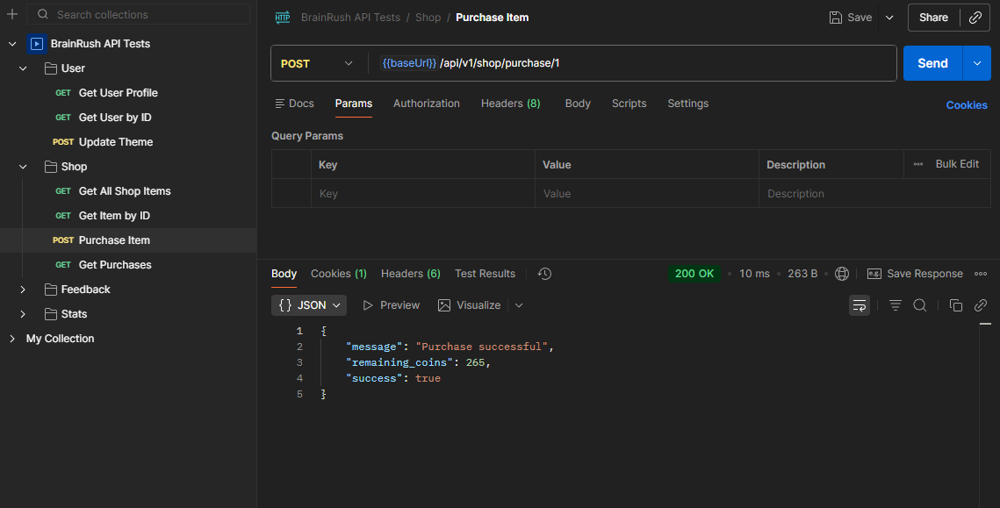

---

### 6. Отримати історію покупок

- **URL:** `/api/v1/shop/purchases`
- **Метод:** `GET`
- **Опис:** Повертає список усіх покупок користувача
- **Автентифікація:** Обов'язкова

**Приклад відповіді:**
```json
{
  "purchases": [
    {
      "id": 1,
      "name": "Color Rush",
      "item_type": "game",
      "price": 50
    },
    {
      "id": 3,
      "name": "Dark Theme Pro",
      "item_type": "theme",
      "price": 100
    }
  ]
}
```

**Скріншот з Postman:**  
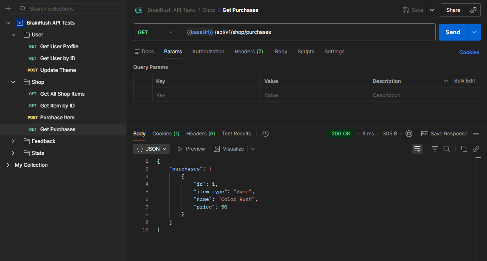

---

### 7. Отримати всі відгуки

- **URL:** `/api/v1/feedback`
- **Метод:** `GET`
- **Опис:** Повертає список відгуків користувачів
- **Автентифікація:** Обов'язкова

**Query параметри:**
- `limit` (опціонально) - Кількість відгуків (default: 50)

**Приклад відповіді:**
```json
{
  "feedback": [
    {
      "id": 1,
      "user_id": 5,
      "name": "player123",
      "email": "",
      "message": "Чудовий додаток!",
      "created_at": "2025-12-15T12:30:00",
      "updated_at": null
    }
  ],
  "count": 1
}
```

**Скріншот з Postman:**  
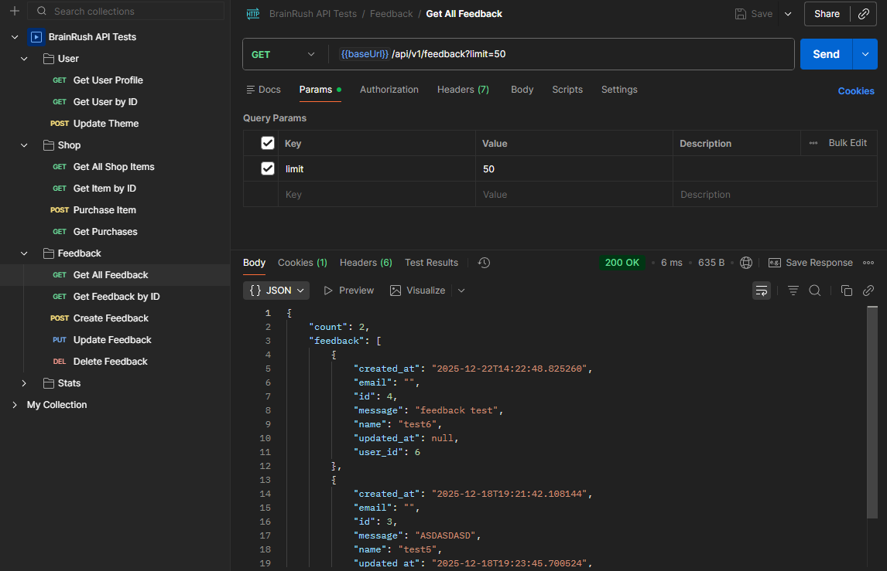

---

### 8. Створити новий відгук

- **URL:** `/api/v1/feedback`
- **Метод:** `POST`
- **Опис:** Створює новий відгук від користувача
- **Автентифікація:** Обов'язкова

**Приклад запиту:**
```json
{
  "message": "Чудовий додаток для тренування мозку!"
}
```

**Приклад відповіді:**
```json
{
  "success": true,
  "feedback_id": 10,
  "message": "Відгук успішно створено"
}
```

**Скріншот з Postman:**  
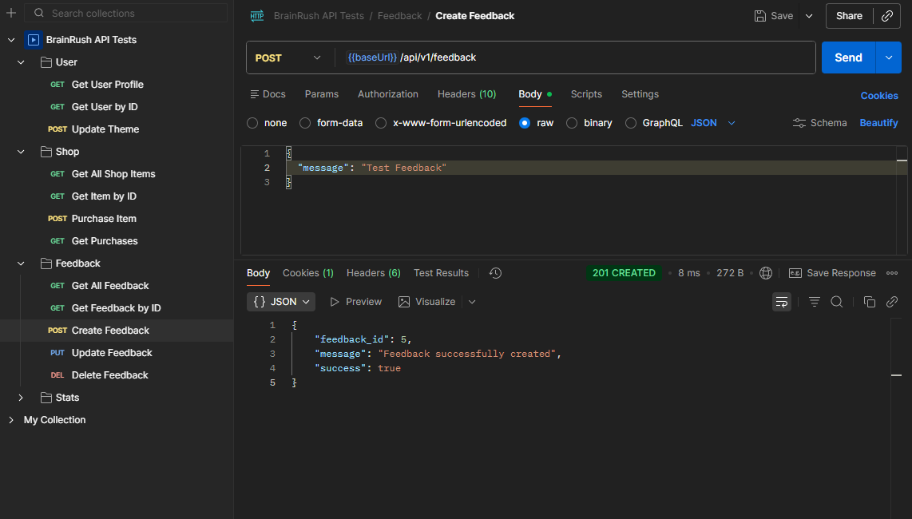

---

### 9. Оновити відгук

- **URL:** `/api/v1/feedback/{feedback_id}`
- **Метод:** `PUT`
- **Опис:** Оновлює існуючий відгук (тільки власний або адміністратор)
- **Автентифікація:** Обов'язкова

**Параметри:**
- `feedback_id` (path) - ID відгуку (integer)

**Приклад запиту:**
```json
{
  "message": "Оновлений текст відгуку"
}
```

**Приклад відповіді:**
```json
{
  "success": true,
  "message": "Відгук успішно оновлено"
}
```

**Скріншот з Postman:**  
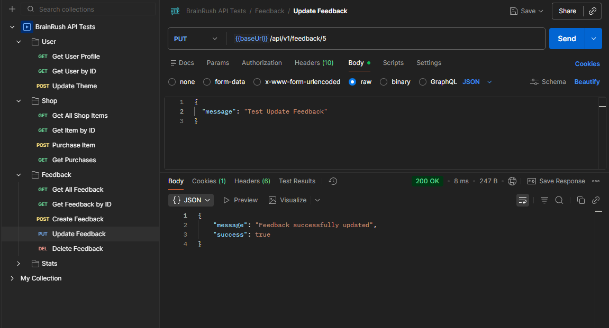

---

### 10. Видалити відгук

- **URL:** `/api/v1/feedback/{feedback_id}`
- **Метод:** `DELETE`
- **Опис:** Видаляє відгук (тільки власний або адміністратор)
- **Автентифікація:** Обов'язкова

**Параметри:**
- `feedback_id` (path) - ID відгуку (integer)

**Приклад відповіді:**
```json
{
  "success": true,
  "message": "Відгук успішно видалено"
}
```

**Скріншот з Postman:**  
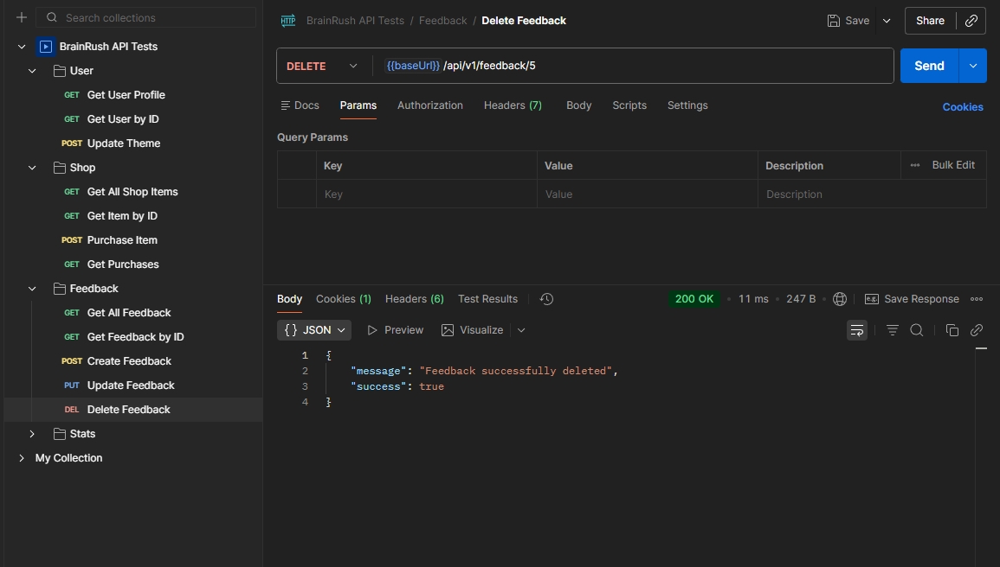

---

### 11. Отримати список ігор користувача

- **URL:** `/api/v1/stats/games`
- **Метод:** `GET`
- **Опис:** Повертає список ігор, у які грав користувач
- **Автентифікація:** Обов'язкова

**Приклад відповіді:**
```json
{
  "games": [
    "arithmetic",
    "color_rush",
    "sequence_recall"
  ]
}
```

**Скріншот з Postman:**  
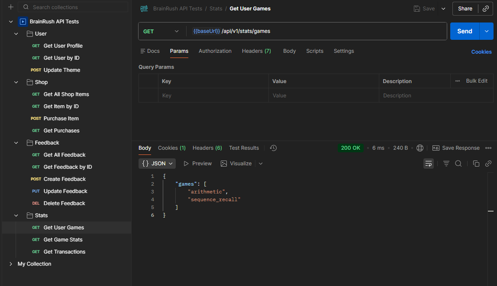

---

### 12. Отримати статистику гри

- **URL:** `/api/v1/stats/game/{game_name}`
- **Метод:** `GET`
- **Опис:** Повертає детальну статистику для конкретної гри
- **Автентифікація:** Обов'язкова

**Параметри:**
- `game_name` (path) - Назва гри (string)

**Приклад відповіді:**
```json
{
  "game": "arithmetic",
  "stats": [
    {
      "level": "easy",
      "rounds": 10,
      "rounds_played": 5,
      "total_score": 450,
      "avg_time": 12.5,
      "total_coins": 45
    },
    {
      "level": "medium",
      "rounds": 10,
      "rounds_played": 3,
      "total_score": 680,
      "avg_time": 18.3,
      "total_coins": 68
    }
  ]
}
```

**Скріншот з Postman:**  
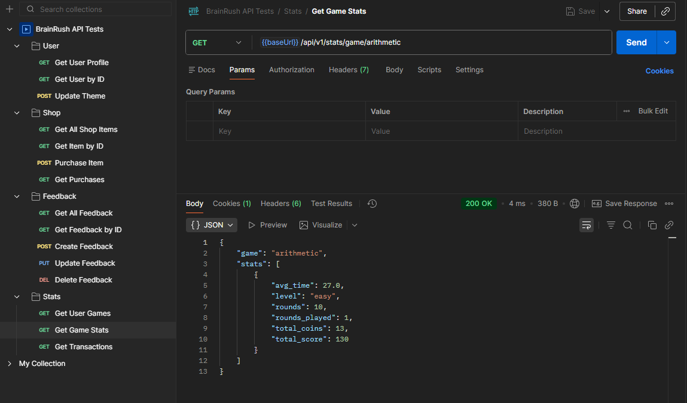

---

### 13. Отримати історію транзакцій

- **URL:** `/api/v1/transactions`
- **Метод:** `GET`
- **Опис:** Повертає історію всіх транзакцій користувача
- **Автентифікація:** Обов'язкова

**Query параметри:**
- `limit` (опціонально) - Кількість транзакцій (default: 50)

**Приклад відповіді:**
```json
{
  "transactions": [
    {
      "id": 15,
      "amount": 45,
      "transaction_type": "game_reward",
      "description": "Earned in arithmetic",
      "created_at": "2025-12-20T15:30:00"
    },
    {
      "id": 14,
      "amount": -50,
      "transaction_type": "purchase",
      "description": "Purchased Color Rush",
      "created_at": "2025-12-19T10:15:00"
    }
  ],
  "count": 2
}
```

**Скріншот з Postman:**  
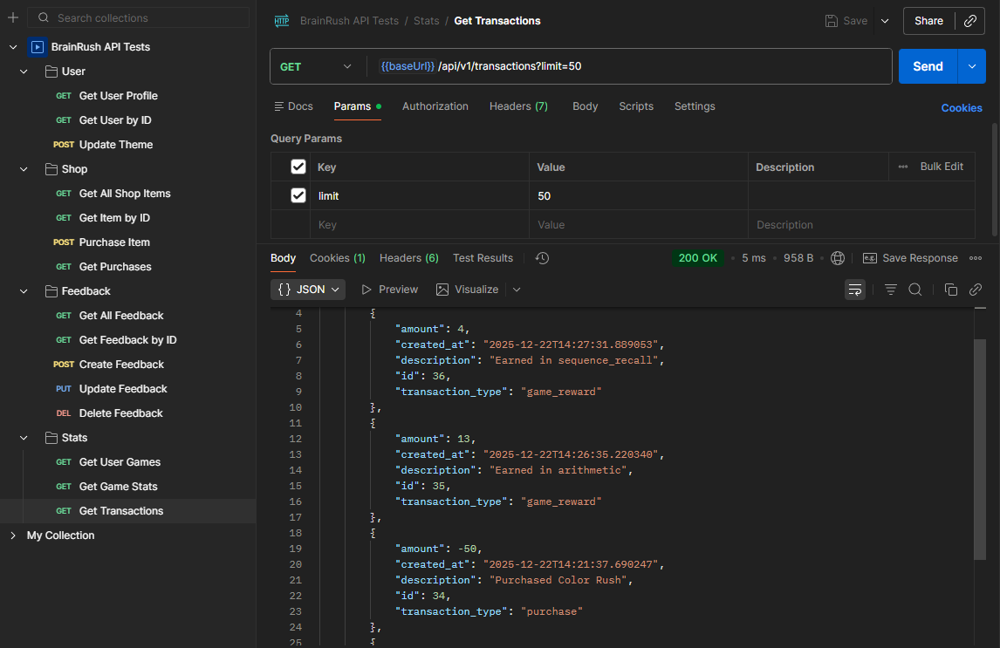

---

## Результати тестування

### Тестовий сценарій 1: Реєстрація та автентифікація

**Мета:** Перевірити процес реєстрації та входу користувача

**Кроки:**
1. POST `/auth/register` з новими даними користувача
2. POST `/auth/login` з тими ж даними
3. GET `/api/v1/user/profile` для перевірки сесії

**Результат:** ✅ Успішно

**Деталі:**
- Реєстрація створює нового користувача з початковим балансом 300 монет
- Логін створює валідну сесію
- Профіль успішно завантажується з правильними даними

**Скріншот:**  


---

### Тестовий сценарій 2: Покупка товару

**Мета:** Перевірити процес покупки товару з магазину

**Кроки:**
1. GET `/api/v1/shop/items` - отримати список товарів
2. GET `/api/v1/user/profile` - перевірити поточний баланс
3. POST `/api/v1/shop/purchase/1` - купити товар
4. GET `/api/v1/shop/purchases` - перевірити історію покупок
5. GET `/api/v1/user/profile` - перевірити оновлений баланс

**Результат:** ✅ Успішно

**Деталі:**
- Початковий баланс: 300 монет
- Ціна товару: 50 монет
- Кінцевий баланс: 250 монет
- Товар додано до списку покупок
- Повторна покупка заблокована

**Скріншот:**  


---

### Тестовий сценарій 3: CRUD операції з відгуками

**Мета:** Перевірити всі операції з відгуками

**Кроки:**
1. POST `/api/v1/feedback` - створити відгук
2. GET `/api/v1/feedback/{id}` - отримати відгук
3. PUT `/api/v1/feedback/{id}` - оновити відгук
4. GET `/api/v1/feedback/{id}` - перевірити оновлення
5. DELETE `/api/v1/feedback/{id}` - видалити відгук
6. GET `/api/v1/feedback/{id}` - перевірити видалення (404)

**Результат:** ✅ Успішно

**Деталі:**
- Всі CRUD операції працюють коректно
- Валідація даних працює (порожнє повідомлення відхиляється)
- Права доступу дотримуються (тільки власник або адмін може редагувати)

**Скріншот:**  


---

### Тестовий сценарій 4: Статистика ігор

**Мета:** Перевірити отримання статистики після гри

**Кроки:**
1. Зіграти гру через веб-інтерфейс
2. GET `/api/v1/stats/games` - перевірити появу гри в списку
3. GET `/api/v1/stats/game/arithmetic` - отримати детальну статистику
4. GET `/api/v1/transactions` - перевірити нараховані монети

**Результат:** ✅ Успішно

**Деталі:**
- Результати ігор зберігаються правильно
- Статистика розраховується коректно (кількість ігор, середній час, очки)
- Монети нараховуються автоматично (1 монета за 10 очок)

**Скріншот:**  


---

### Тестовий сценарій 5: Зміна теми

**Мета:** Перевірити зміну теми інтерфейсу

**Кроки:**
1. POST `/api/v1/user/theme` з `{"theme": "dark"}`
2. GET `/api/v1/user/profile` - перевірити збережену тему
3. Перевірити доступність темної теми (чи придбана)

**Результат:** ✅ Успішно

**Деталі:**
- Тема успішно змінюється
- Зміни зберігаються в базі даних
- Темна тема вимагає покупки з магазину

**Скріншот:**  


---

### Тестовий сценарій 6: Обробка помилок

**Мета:** Перевірити коректну обробку помилкових запитів

**Тестові випадки:**

1. **401 Unauthorized** - запит без автентифікації
    - GET `/api/v1/user/profile` без cookie
    - ✅ Повертає `{"error": "Потрібна автентифікація"}`

2. **404 Not Found** - неіснуючий ресурс
    - GET `/api/v1/user/9999`
    - ✅ Повертає `{"error": "Користувача не знайдено"}`

3. **400 Bad Request** - некоректні дані
    - POST `/api/v1/feedback` з порожнім message
    - ✅ Повертає `{"error": "Повідомлення обов'язкове"}`

4. **403 Forbidden** - недостатньо прав
    - PUT `/api/v1/feedback/1` іншого користувача
    - ✅ Повертає `{"error": "Доступ заборонено"}`

**Результат:** ✅ Успішно

**Скріншот:**  


---

## Обробка помилок

API використовує стандартні HTTP коди стану для позначення успіху або помилки запиту.

### Коди відповідей

#### 2xx - Успіх
- **200 OK** - Запит успішно оброблено
- **201 Created** - Ресурс успішно створено (використовується при створенні відгуків)

#### 4xx - Помилки клієнта
- **400 Bad Request**
    - Некоректний формат даних у запиті
    - Відсутні обов'язкові поля
    - Порожнє повідомлення у відгуку
    - Приклад: `{"error": "Повідомлення не може бути порожнім"}`

- **401 Unauthorized**
    - Відсутня автентифікація
    - Неавторизований доступ до захищених endpoints
    - Приклад: `{"error": "Потрібна автентифікація"}`

- **403 Forbidden**
    - Недостатньо прав для виконання операції
    - Спроба редагувати чужий відгук
    - Приклад: `{"error": "Доступ заборонено"}`

- **404 Not Found**
    - Запитуваний ресурс не знайдено
    - Неіснуючий ID користувача, товару, відгуку
    - Приклад: `{"error": "Користувача не знайдено"}`

#### 5xx - Помилки сервера
- **500 Internal Server Error**
    - Непередбачена помилка на сервері
    - Помилка бази даних
    - Приклад: `{"error": "Внутрішня помилка сервера"}`

### Формат помилок

Всі помилки повертаються у JSON форматі:

```json
{
  "error": "Опис помилки",
  "success": false  // для деяких endpoints
}
```

### Приклади обробки помилок

**Недостатньо монет для покупки:**
```json
{
  "success": false,
  "error": "Not enough coins"
}
```

**Товар вже придбано:**
```json
{
  "success": false,
  "error": "Already purchased"
}
```

**Товар не знайдено:**
```json
{
  "error": "Товар не знайдено"
}
```

---

## Висновки

### Підсумок тестування

✅ **Всього протестовано:** 13 endpoints  
✅ **Успішних тестів:** 13  
❌ **Невдалих тестів:** 0

## Додаткова інформація

**Swagger UI:** Доступний за адресою `http://localhost:5000/api/docs`

**Postman колекція:** Доступна у файлі `BrainRush_API.postman_collection.json`

**OpenAPI специфікація:** Доступна у файлі `swagger.yaml`

---

*Звіт створено: [Дата]*  
*Версія документа: 1.0*